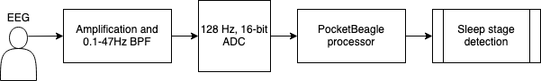

# Trail Nap Alarm
## Overview

### Introduction and problem statement:
Ultra marathon runners, i.e., runners who run distances longer than a marathon, often do “trail naps,” i.e., they simply lay down on the trail and power nap for 5-10min. When it’s cold, one wakes up after a short period of time, but when it’s warm(er), it’s likely that the runner will sleep longerthan they want. Setting an alarm is tedious, time-consuming, and the alarm may not be heard. Also,sometimes it takes a few minutes to fall asleep, so estimating the wake-up time is hard and the resulting sleep time is rarely ideal.
The goal of this project is to build a device that monitors a runner’s sleep and wakes them up aftersleep stage N1, before they fall into a REM sleep pattern. Non-REM sleep has 3 stages ([Source:](https://www.uofmhealth.org/health-library/hw48331)):
* **Stage** N1 occurs right after you fall asleep and is very short (usually less than 10 minutes).It involves light sleep from which you can be awakened easily.
* **Stage N2** lasts from about 30 to 60 minutes. During this stage, your muscles become more relaxed and you may begin to have slow-wave (delta) brain activity.
* **Stage N3** is deep sleep and lasts about 20 to 40 minutes. During this stage, delta brain activity increases and a person may have some body movements. It is very hard to wake up someone in stage N3.

### Specific project goals
1. Build a sensor system that allows to detect the different sleep patterns. The sensor system needs to be small, simple, non-invasive, and ultra-low power. E.g., an armband, electrodes embedded in a hat, etc.
2. Build a system that reliably wakes up a person. E.g., a combination of sound, vibration, etc. That part must also be small, simple, non-invasive, and ultra-low power.
3. An integration of these two sub-components into a fully functional system. Cables should be avoided. If communication between sub-systems is necessary, that should rely on Bluetooth or other protocols.
4. The system must be battery-powered. The batteries should last for at least 3 days (72 hours). The batteries should be rechargeable with a USB cable.
5. The overall system must be small, non-invasive, light, water-proof, easy to use, and have no on-off or other switches.

## Project status
This project is unfinished and serves only as a proof-of-concept. The intention is for the final product to be as passively-operational as possible - meaning that all the user has to do is turn it on and wear it during a nap, then turn it off when they are woken up. For further development, please refer to the [documentation in the wiki for this repository](https://github.com/cteusche/TrailNapAlarm/wiki).

To start developing this project:
1. Clone this repository
2. Install [conda mini-forge](https://github.com/conda-forge/miniforge) package handler.
3. In the terminal, go to the home directory of this repo and run the command 
   
   `conda env create -f environment.yml` 
   
   to set up a new conda environment and install the required python libraries into it.

## Directory structure
* [src](https://github.com/cteusche/TrailNapAlarm/src)
    * Source code files belong here
* [tools]()
    * Tools like Makefile and other scripts belong here
* [docs]()
    * Documentation files belong here
* [dep]()
    * Dependencies belong here
* [res]()
    * Resource files belong here

